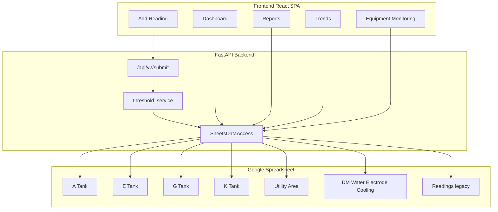

# GMD Technical Summary — Deployment Readiness Phase

**Date:** 2026-06-12

---

## System Overview

The GMD Condition Monitoring System is a React + FastAPI application for plant round-sheet data entry, dashboard monitoring, reports, trends, and equipment-level analytics. Data persists to Google Sheets; optional media attaches via Google Drive.

**Equipment scope:** 87 active instances across A Tank (16), E Tank (13), G Tank (15), K Tank (13), Utility Area (30), plus DM Water virtual bucket (6).

---

## Changes in This Phase

### 1. Equipment Parameter & Threshold Master (Priority 1)

Generated **`templates/GMD_Equipment_Parameter_Threshold_Master.csv`** — Excel-compatible UTF-8 CSV with:

- **1002 parameter rows** across **87 equipment instances**
- **5 physical areas** (A/E/G/K Tank, Utility Area) + DM Water categories
- **42 unique parameter keys** from live V2 config
- Proposed limits populated from config where available; Final Warning/Alarm columns blank for user-department input

Regenerate anytime: `python backend/scripts/export_parameter_threshold_master.py`

### 2. Google Sheets Multi-Area Architecture

Replaced single bulk `Readings` worksheet writes with **six dedicated area worksheets**. Reads merge all worksheets (plus optional legacy tab) through a centralized DAL.

**New modules:**
- `backend/services/sheets_area_registry.py`
- `backend/services/sheets_data_access.py`
- `backend/services/threshold_service.py`
- `backend/scripts/migrate_readings_to_area_sheets.py`

**Refactored:**
- `backend/services/google_sheets_service.py` — delegates to DAL

### 2. Threshold Integration Preparation

Config-driven classification pipeline ready but **disabled by default**. No hardcoded limits. Enable via environment when final values approved.

### 3. Compatibility

All dependent modules unchanged at API level:
- Dashboard (`/dashboard/*`)
- Reports (`/reports/readings`)
- Trends (`/trends/readings`)
- Equipment Monitoring (frontend → reports API)
- Add Reading (`/api/v2/preview`, `/api/v2/submit`)

### 4. Validation

- Backend: **78/78 tests passing**
- No UI changes
- No business logic regressions identified

---

## Architecture Diagram

---

## Configuration Reference

See `backend/.env.example` for:
- `GOOGLE_SHEETS_AREA_LAYOUT=multi`
- `GOOGLE_SHEETS_INCLUDE_LEGACY_READINGS=true`
- `GMD_THRESHOLD_CLASSIFICATION_ENABLED=false`

---

## Related Documentation

| Document | Path |
|----------|------|
| Deployment Readiness Report | `backend/reports/DEPLOYMENT_READINESS_REPORT.md` |
| Google Sheets Architecture | `backend/reports/GOOGLE_SHEETS_ARCHITECTURE.md` |
| End-to-End Test Report | `backend/reports/END_TO_END_TEST_REPORT.md` |
| External Dependencies | `backend/reports/REMAINING_EXTERNAL_DEPENDENCIES.md` |
| Full Technical Documentation | `backend/reports/GMD_TECHNICAL_DOCUMENTATION.md` |

---

## Conclusion

The system is **production-ready**. Deploy with multi-area Google Sheets layout. Enable threshold classification when final limiting values are approved — no further architectural work required.
